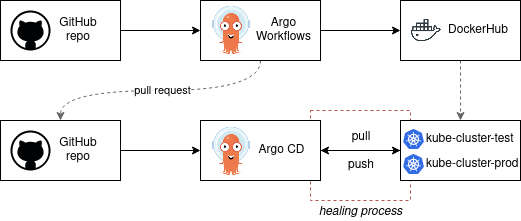

# GitOps Automation Project

Projecto de automatizacion de ciclo CI/CD en Kubernetes con Argo Workflows y Argo CD, utilizando GitHub y DockerHub como repositorios de codigo e imagenes, respectivamente. La idea final es lograr observabilidad en cada fase del ciclo y de las diferentes metricas de interes.

## Indice

- [GitOps Automation Project](#gitops-automation-project)
  - [Indice](#indice)
  - [Objetivos](#objetivos)
  - [Que esperar](#que-esperar)
  - [Tecnologias Involucradas](#tecnologias-involucradas)
  - [GitOps](#gitops)
    - [Ventajas de GitOps](#ventajas-de-gitops)
    - [Kubernetes CI/CD](#kubernetes-cicd)
  - [Instalacion y Configuracion de Herramientas](#instalacion-y-configuracion-de-herramientas)
    - [Registrarse en GitHub, Bitnami y DockerHub](#registrarse-en-github-bitnami-y-dockerhub)
    - [Instalaciones](#instalaciones)
      - [Git](#git)
    - [Repositorio de Codigo](#repositorio-de-codigo)

## Objetivos

El objetivo principal es establecer una pipeline CICD automatizada que optimice el ciclo de despliegue de software.

## Que esperar

En este repositorio encontraras informacion detallada de cada tecnologia y paso involucrados en el ciclo CI/CD, meticulosamente documentado y explicado.

## Tecnologias Involucradas

- **Git**: Sistema de control de versiones distribuido.
- **GitHub**: Plataforma para el control de versiones con Git.
- **Docker**: Tecnología utilizada para la creación, implementación y gestión de contenedores.
- **DockerHub**: Plataforma para alojar imágenes de contenedores Docker, facilitando su distribución y uso.
- **Kubernetes**: Kubernetes facilita la gestión de múltiples contenedores, proporcionando capacidades avanzadas de orquestación, automatización y escalabilidad para aplicaciones en entornos de producción.
- **Minikube**: Herramienta que permite crear clústeres de Kubernetes locales para pruebas y desarrollo.
- **Helm**: Gestor de paquetes de Kubernetes que simplifica y automatiza tareas de implementación.
- **Bitnami**: Bitnami contribuye con una extensa colección de charts de Helm, simplificando la implementación de aplicaciones complejas en Kubernetes al ofrecer configuraciones predefinidas y listas para usar.
- **Argo** **Workflows**: Orquestador de flujos de trabajo complejos dentro de Kubernetes.
- **Argo** **CD**: Herramienta que facilita la implementación continua basada en GitOps para Kubernetes.
- **HashiCorp Vault**: Gestion de Secrets para Kubernetes
- **Grafana**: Plataforma para monitorear y visualizar datos provenientes de diversas fuentes.
- **Prometheus**: Sistema de monitorización y alerta de código abierto que recopila métricas de sistemas y servicios.

## GitOps

GitOps es una metodologia y practica que utiliza los repositorios Git como fuente **unica** de verdad par el despliegue de aplicaciones e infraestructura como codigo.

Si bien GitOps es un concepto **agnostico**, el framework GitOps puede construirse con herramientas como Git, Kubernetes, ArgoCD y Argo Workflows.

Las principales caracteristicas de GitOps son:

- **Declarativo**: Un sistema GitOps debe expresar su estado **deseado** de forma **declarativa**.
- Versionado: El estado deseado es **almacenado** para asegurar su **inmutabilidad y versionado**, reteniendo un historial completo de versiones.
- **Auto-Pull**: Agentes observan el estado deseado de la infraestructura de forma continua y realiazn el *pull* necesario.
- **Reconciliacion continua (*healing*)**: Los agentes observan de forma continua el estado actual del sistema y realizan acciones para lograr el estado deseado.

### Ventajas de GitOps

Con GitOps, las caracteristicas listadas previamente dan lugar a un ecosistema donde los cambios realizados en la infraestructura o en la aplicacion son rastreables y auditables. Este concepto beneficia a developers y equipos de operaciones para mejorar la respuesta ante problemas. Entre los principales beneficios cabe destacar:

- Consistencia Multicluster
- Seguridad Mejorada
- Visibilidad y auditoria de todos los cambios
- Estandarizacion de Workflow
- Automatizacion de proceso de integracion y despliegue

### Kubernetes CI/CD

Integracion Continua (CI) y Entrega Continua (CD) son metodos de despliegue de aplicaciones de forma automatica **entre cada ciclo** de desarrollo.

Con Kubernetes es simple implementar una pipeline CI/CD dentro de un cluster. El ciclo CI/CD se genera de la siguiente forma:

1. Un desarrollador implementa cambios en el codigo de una aplicacion.
2. El cambio se efectiviza en el **repositorio de codigo** (*GitHub*) y dispara la **pipeline CI** (*Argo Workflows*)
3. La pipeline compila, testea y buildea el codigo creando/actualizando una **imagen de contenedor**
4. La imagen se sube al **repositorio de imagenes** (DockerHub)
5. Un agente de herramienta CD (*Argo CD*) monitorea el repositorio de imagenes y detecta los cambios de configuracion.
6. La pipeline CD (*Argo CD*) actualiza los archivos de configuracion del repositorio de Git. (*GitHub*).
7. La herramienta CD (*Argo CD*) observa el nuevo estado deseado de la infraestructura y lo sincroniza con el estado actual del entorno Kubernetes. Este proceso es llamado **healing**

A continuacion se explican las palabras claves del texto anterior:

```md
- **Repositorio de código:** Lugar donde se almacena y gestiona el código fuente de un software. GitHub permite colaborar, versionar y controlar el código de los proyectos.

- **Contenedor:** Es una unidad de software ligera que incluye todo lo necesario para ejecutar una aplicación, como bibliotecas, código, tiempo de ejecución y dependencias. Los contenedores son independientes de la infraestructura y pueden ejecutarse de manera consistente diferentes entornos.

- **Imagen de contenedor:** Es la plantilla sobre la cual se basan los contenedores para ejecutar instancias específicas de una aplicación.

- **Repositorio de imágenes de contenedor:** Lugar donde se almacenan y organizan las imágenes de contenedor, por ejemploDockerHub. Estos repositorios permiten subir, descargar y gestionar imágenes de contenedor, lo que facilita la distribución y la implementación de aplicaciones en entornos basados en contenedores, por ejemplo un cluster Kubernetes.
```

Un ejemplo simplificado de un ciclo CI/CD explicado anteriormente se muestra a continuacion 




## Instalacion y Configuracion de Herramientas

> Disclaimer: Las instalaciones se realizaran sobre un sistema operativo Ubuntu 22.04 en Enero 2024. Ante cualquier inconveniente se sugiere ir a la documentacion oficial de cada herramienta.

### Registrarse en GitHub, Bitnami y DockerHub

- Crear cuenta en [GitHub](https://github.com/)
- Crear cuenta en [DockerHub](https://hub.docker.com/)
- Crear cuenta en [Bitnami](https://bitnami.com/) (puede loguearse con la cuenta de GitHub creada previamente)

### Instalaciones

#### Git

Verificar si tenemos git instalado 

```sh
git --version
```

De lo contrario 

```sh
sudo apt update
sudo apt install git
git --version
```


### Repositorio de Codigo

